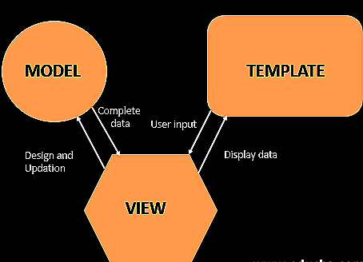

---

### Django Architecture

* Called MVT Structure (Models / Views / Templates). This is a pattern for developing web applications.
  * "Model: The model is going to act as the interface of your data. It is responsible for maintaining data. It is the logical data structure behind the entire application and is represented by a database (generally relational databases such as MySql, Postgres)."
  * "View: The View is the user interface — what you see in your browser when you render a website. It is represented by HTML/CSS/Javascript and Jinja files."
  * "Template: A template consists of static parts of the desired HTML output as well as some special syntax describing how dynamic content will be inserted."
* **\_\_init\_\_.py** – It is a python package. It is invoked when the package or a module in the package is imported. We usually use this to execute package initialization code, for example for the initialization of package-level data.
* **settings.py** – As the name indicates it contains all the website settings. In this file, we register any applications we create, the location of our static files, database configuration details, etc.
* **urls.py** – In this file, we store all links of the project and functions to call.
* **wsgi.py** – This file is used in deploying the project in WSGI. It is used to help your Django application communicate with the webserver.

---

### URLs
* urls.py is the file that contains all URL patterns used by the website.
  * [URL Dispatcher](https://docs.djangoproject.com/en/4.0/topics/http/urls/) This is Django's URL scheme.
    * Need to create URLconf; it maps URL path expressions to python functions (your views).
    * Q: How does Django determine which Python code to execute when a user requests a page?
      * Django determines the root URLconf module to use - this value is in the ROOT_URLCONF setting
      * Loads that module and looks for the variable **urlpatterns**. 
      * Runs through each URL pattern - in order - and stops at the first match of the requested URL, matching against path_info.
      * When the URL patterns match up, Django will import and call that given view. This should be a python function ([or a class-based view](https://docs.djangoproject.com/en/4.0/topics/class-based-views/)). The view will get passed the following arguments:
        * "An instance of HttpRequest"
        * "If the matched URL pattern contained no named groups, then the matches from the regular expression are provided as positional arguments"
        * "The keyword arguments are made up of any named parts matched by the path expression that are provided, overridden by any arguments specified in the optional kwargs argument to django.urls.path() or django.urls.re_path()."
      * If no URL pattern matches or an exception is raised, Django will do the error handling view.

---

### Models
* [Models](https://www.geeksforgeeks.org/django-models/) are a built-in django feature that is used to create tables, their fields, and various constraints.
  * _Django provides an abstraction layer (the “models”) for structuring and manipulating the data of your web application. Learn more about it below:_
  * It's like the SQL db for Django. The models simplify this task and organize tables into models. 
  * Generally, each Django model will map to a single database table.
  * You can use the Django admin page to create, update, delete or retrieve fields of a model + more.
  * Basics of models?
    * Each model is a Python class that subclasses django.db.models.Model.
    * Each attribute of the model represents a database field.
    * Once you've created a django model, you will want to [make queries](https://docs.djangoproject.com/en/3.0/topics/db/queries/)
    * Django maps the fields defined in Django models into table fields of the database as shown below. 
     *source: geeks for geeks*
    * The models created are tables that will be stored in the SQLite database.

---

### Views
* [View Function](https://docs.djangoproject.com/en/4.0/topics/http/views/) is a Python function that takes a web request and returns a web response.
* The response can be the HTML contents of a web page, or a redirect, or a 404 error, or an XML document, etc.
  * _Django has the concept of “views” to encapsulate the logic responsible for processing a user’s request and for returning the response._
  * [Middleware](https://docs.djangoproject.com/en/4.0/topics/http/middleware/) is a light, low-level plug-in system for globally altering Django's input or output

---

### Templates
* [Templates](https://docs.djangoproject.com/en/4.0/topics/templates/) Django needs a convenient way to generate HTML dynamically. Most common approach relies on templates. A template contains the static parts of the desired HTML output.
  * _The template layer provides a designer-friendly syntax for rendering the information to be presented to the user._
  * Default template: Django template language (DTL)

---
### Forms
* [Forms](https://docs.djangoproject.com/en/4.1/topics/forms/) provide Django with a rich framework to facilitate manipulating/creating HTML forms.
  * A form is a collection of elements inside < form > ... < /form >. This allows a visitor to do things like enter text, select options, etc - then, it sends that info to the server.
